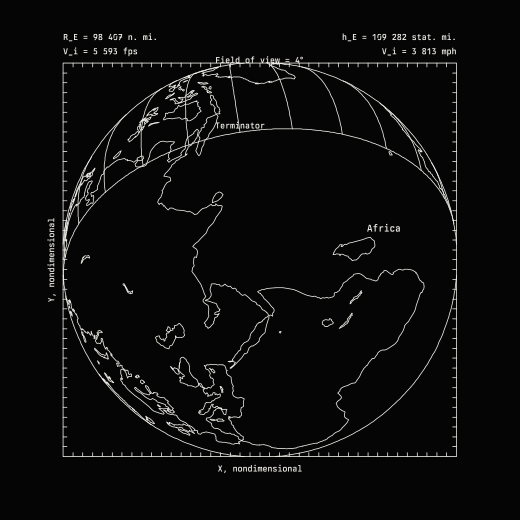

# Apollo Software Library

<p align="center">
  
</p>
<p align="center"><em>The Earth from Apollo 11's command module, 22 to 27 hours after launch, drawn by the recreation.</em></p>

Working recreations of the software that planned and flew the Apollo missions, each shown next to the NASA documents
it was rebuilt from.

**Live site: [apollo-software-library.vercel.app](https://apollo-software-library.vercel.app)**

The first entry is the **view program**. During the Apollo missions, analysts at NASA's Manned Spacecraft Center
(MSC) in Houston used it to draw what the crews would see from the spacecraft: the Earth and Moon in the window, the stars
in the telescopes, the lunar surface during the landing. It ran on a UNIVAC 1108 and put each picture on microfilm.
Crews used the printed pictures as charts, and MSC cut some of the frames into a film.

The program's source code is not known to survive. This project rebuilds it from the 1969–72 documents that
describe it and the pictures it printed, then checks each rebuilt picture against a scan of the original.

## What you can do on the site

- **Watch the film.** Four reels computed frame by frame in your browser: the Earth shrinking behind Apollo 11, the
  Moon growing on the approach, stars in the command module's telescope, and a turning lunar module.
- **Compare with the originals.** Each figure has the recreation, a scan of the original, and an overlay of the
  two. A table lists how far each star or landmark lands from where the original printed it.
- **Change the inputs.** Set a different mission time or gimbal angle in an exhibit's "Try it" panel and the
  picture is recomputed.
- **See the quick-look printout.** The program could print a rough version of a picture on a line printer before
  the microfilm came back. The site draws that version too.
- **Read the sources.** The NASA documents are on the site, opened to the page each exhibit comes from.

## How close is it?

The project reports two kinds of result and keeps them apart.

- A **prediction** recomputes a figure from its printed inputs with nothing adjusted to match. Its pass mark was
  written down before the scan was measured. When a prediction misses, the miss is recorded and analysed, and the
  inputs stay as printed.
- A **fit** is used where the documents never printed an input, usually the spacecraft's attitude. The attitude is
  solved from the figure itself, so a small error shows the figure is self-consistent. It is not a prediction.

Every result below has an entry in the [ledger](docs/ledger.md), cited by item number.

| Exhibit | Compared | Kind | Result | Ledger |
|---|---|---|---|---|
| Fig 3a, scanning telescope, rev 30 | 12 labelled bodies | calibration: the plotting convention was chosen by fitting this figure | 0.62° RMS, max 1.60° | [proof of concept](docs/ledger-proof-of-concept.md) |
| Fig 3b | 8 labelled bodies | prediction | 0.52° RMS (limit 1.0°) | Item 1.3 |
| Fig 3c | 10 labelled bodies | consistency check: the gimbal sign, printed wrong in both documents, was inferred from this figure | 0.71° RMS | Item 1.3 |
| Fig 4(b)–(f), LM alignment telescope | predicted from the attitude fitted on (a) | prediction | 2 of 5 within limits; (b), (c), (e) missed | Item 1.7 |
| Fig 3b lunar limb | limb from the command module's position | prediction | missed (8.8° RMS) | Item 5.7 |
| 1,078-star catalogue (69-FM-107) | rows matched to the Bright Star Catalogue | — | 826 verified; the target of 1,000 missed (the rest failed OCR and could still be transcribed by hand) | Item 7 |
| Trajectory vs Fig 6 | Earth distance and speed, 23–26 h | prediction | pass (0.3–0.8%, limit 1%) | Item 5.4 |
| Trajectory vs Fig 7 | Moon distance and speed, 70–72 h | prediction | missed: the figure disagrees with its own source | Item 5.4 |
| Mission Report rows against each other | radius, speed, direction | prediction | radius and speed pass (≤ 0.33%); direction after lunar orbit insertion missed (3.0°, limit 1°); along-track drift of 3.2° over 10 lunar orbits (point-mass Moon); 7 rows of the 1969 table found misprinted or inconsistent | Item 5.4, Item 5.5 |
| Fig 6, Earth views | disc, terminator, 30 coastal landmarks | prediction for (b)–(d); (a) was used to find the plot's "up" (the direction of travel) | all pass (≤ 1.54%, limits 2–3%) | Item 2.5 |
| Fig 7, Moon views | disc, lighting | prediction | missed: the figure does not match its own printed times | Item 2.5 |
| Figs 1–2, window views at translunar injection and entry | window outline on both; stars; Sun and planets; horizon | outline: prediction; stars: fit | outline within 0.96° (pass); stars 0.41°/0.36° RMS (fit); Fig 1's Sun and Venus sit where they were three days later; horizon missed | Item 3.3 |
| LM descent (69-FM-197 powered-descent frames) | Sun; horizon; stars | Sun and horizon: prediction; stars: fit | Sun within 0.6° (pass); horizon passes at 2:06, missed at ignition (max 4.2°) and at 5:26 | Item 4 |

The miss that keeps coming back is the horizon. On Figs 1, 2 and 3b the 1969 program drew the Earth's or Moon's
horizon as a clean circle much smaller than the true one, and the rule it used has not been recovered. On the descent
frames the drawn horizon comes close early in the burn, and the Earth's disc in Fig 6 matches.

Everything the recreation can't reproduce, what doesn't survive from 1969, and what's still unknown is listed on the
site's [Limits page](https://apollo-software-library.vercel.app/view-program/limits/).

## Run it locally

You need [Bun](https://bun.sh) 1.3.

```sh
git clone https://github.com/rblalock/apollo-software-library.git
cd apollo-software-library
bun install
bun run dev                # the site at http://localhost:4321
```

Other commands, all run from the repository root:

```sh
bun run test               # engine, script and site tests, including every comparison with a scan
bun run typecheck          # the engine
bun run typecheck:scripts  # the data scripts
bun run check:site         # Astro and the site's TypeScript
bun run build              # the static site, written to site/dist
```

`dev` and `build` first copy the source PDFs and figure scans into `site/public`. The site needs no server, database
or environment variables.

## Repository layout

| Path | Contents |
|---|---|
| `packages/view-engine` | The recreation itself, in TypeScript with no framework: time scales, star catalogues, reference frames and gimbal angles, ephemerides, trajectory integration, the Apollo 11 Mission Report state vectors, projections, the Earth and Moon globes, hidden-line vehicle models, the SVG and line-printer plotters, and attitude fitting. |
| `site` | The website: Astro pages with React for the interactive exhibits, styled with Tailwind. |
| `data/sources` | The NASA PDFs, with a checksum and download address for each in `SOURCES.md`. |
| `data/manual` | Inputs made by hand: transcribed tables, figure crops and positions read off the scans, each with the reason it was needed. |
| `data/derived` | Generated data. Every file records its sources and the script that made it. |
| `scripts` | The data pipeline that turns the PDFs and public datasets into `data/derived`, with its tests in `scripts/test`. |
| `docs` | The [ledger](docs/ledger.md) of every decision and result, and the [design documents](docs/design/). |

## Rebuilding the data

The generated files in `data/derived` are committed, so you only need this to change the pipeline. The scripts also
need `pdftoppm` (poppler), `tesseract`, `unzip`, and ImageMagick (`magick`, used by `zoom-grid.ts`).

```sh
bun scripts/fetch-sources.ts                              # the NASA PDFs, checked against their checksums
bun scripts/build-bsc.ts && bun scripts/build-agc-stars.ts
bun scripts/ocr-rtcc.ts && bun scripts/build-rtcc-catalog.ts
bun scripts/ocr-cat1078.ts && bun scripts/build-cat1078.ts
bun scripts/fetch-geodata.ts                              # coastlines, lunar craters and maria
bun scripts/extract-figures.ts                            # figure crops from the PDFs
bun scripts/digitize-figure.ts                            # labelled bodies and star dots
bun scripts/digitize-limb.ts && bun scripts/digitize-globe.ts && bun scripts/digitize-arcs.ts
bun scripts/build-site-data.ts                            # star directions for the site
bun scripts/readme-animation.ts                           # the animation at the top of this README
bun scripts/og-image.ts                                   # the link-preview image, site/public/og.png
```

The last two scripts also need `rsvg-convert` (librsvg), and the animation needs `ffmpeg`.

## Deploying

The site is static. `vercel.json` holds the build settings and cache headers for Vercel, which builds each push to
`main` from GitHub. On another static host, use these settings:

- Install with `bun install` and build with `bun run build`, both at the repository root.
- Serve `site/dist`. It is about 37 MB, 32 MB of which is the NASA PDFs. The largest file is 11.8 MB.
- Cache `/_astro/*` for a year (the file names carry a content hash) and `/docs/*` and `/scans/*` for a week.

## Contributing

Issues and pull requests are welcome. The results above leave two problems open: the rule the 1969 program used to
draw the horizon, and the catalogue rows that OCR could not read.

One rule governs the comparisons: never change an input to make a comparison pass. If you find a better input, give
the document and page it comes from. If a comparison fails, the failure stays in the results with its analysis.
Record decisions in [docs/ledger.md](docs/ledger.md) in the form used there.

## Sources and rights

The code is released under the [MIT License](LICENSE).

The primary documents are NASA publications in the public domain. The site also uses:

- Natural Earth coastlines (public domain)
- Lunar crater names and positions from the IAU/USGS Gazetteer of Planetary Nomenclature (public domain)
- Lunar mare boundaries from LROC (Nelson et al. 2014, NASA PDS)
- The Yale Bright Star Catalogue (VizieR V/50)
- The Apollo guidance computer's star tables, from the Virtual AGC project

This project is independent and not affiliated with NASA.
